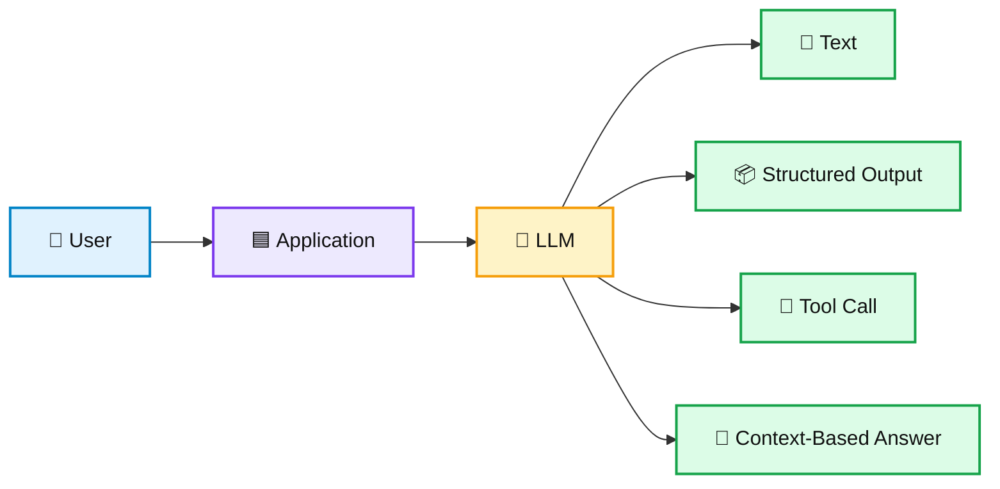
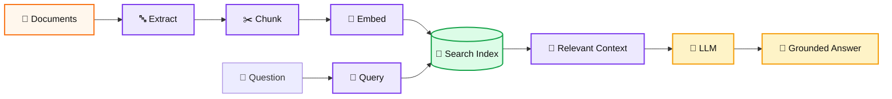
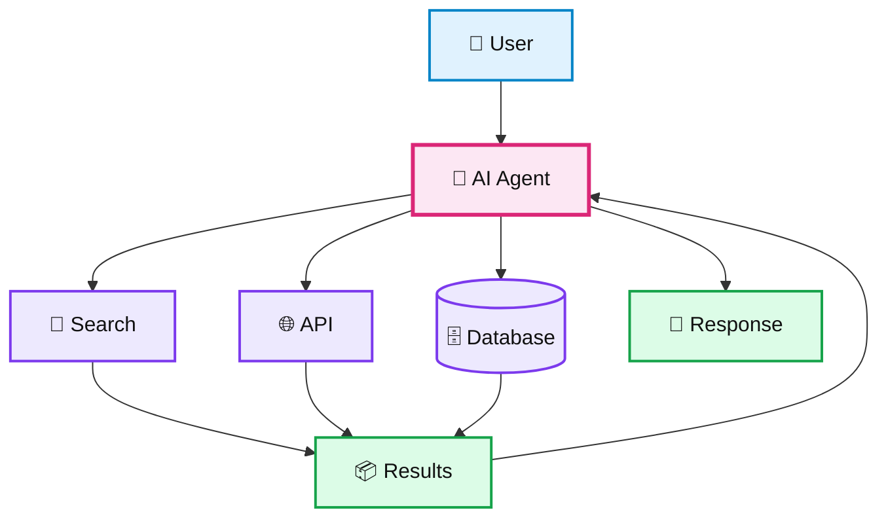
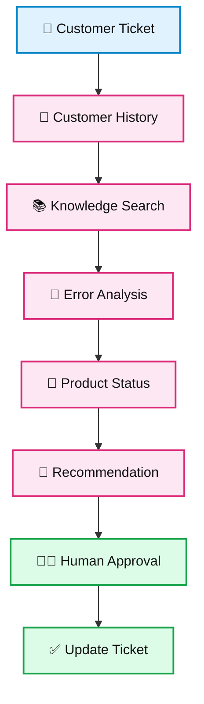
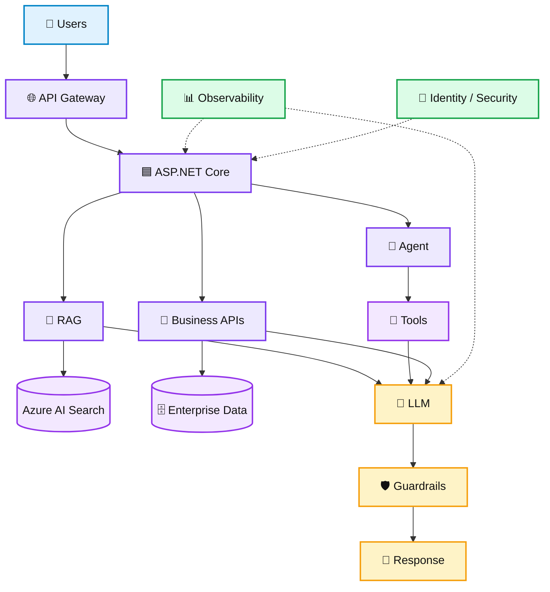
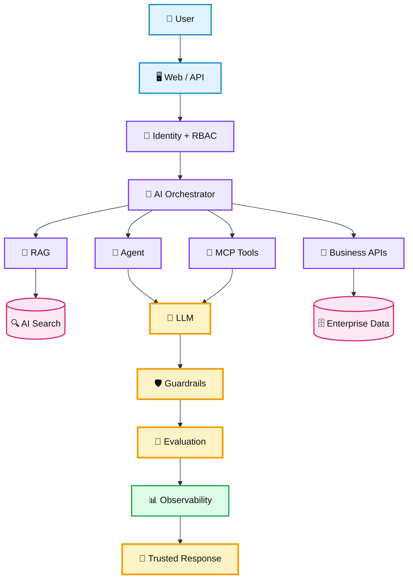

# 🚀 GenAI & Agentic AI with .NET — A Practical Roadmap

> **From .NET Developer → AI Engineer → AI Solution Architect**
>
> A simple, visual, step-by-step roadmap for C# and .NET developers learning **Generative AI, LLMs, RAG, Tool Calling, AI Agents, Agentic AI, MCP and Production AI Architecture**.

[](https://learn.microsoft.com/dotnet/csharp/)
[](https://dotnet.microsoft.com/)
[](https://learn.microsoft.com/aspnet/core/)
[](https://azure.microsoft.com/)
[](https://learn.microsoft.com/azure/ai-services/)
[](./RAG-using-csharp.md)
[](https://learn.microsoft.com/)
[](https://modelcontextprotocol.io/)

**Keywords:** `C#` `.NET` `DotNet AI` `ASP.NET Core` `Generative AI` `GenAI` `LLM` `RAG` `AI Agents` `Agentic AI` `MCP` `Tool Calling` `Semantic Kernel` `Microsoft.Extensions.AI` `Azure AI` `Azure OpenAI` `Azure AI Search` `AI Architecture` `Enterprise AI` `AI Engineering`

---

# 🎯 Who Is This Guide For?

This roadmap is designed for:

- C# developers
- .NET developers
- ASP.NET Core developers
- Backend engineers
- Software engineers
- Technical leads
- Solution architects
- Enterprise application developers
- Developers moving from traditional software to AI

### The good news 💡

You **do not need to become a data scientist first**.

Your existing skills in:

```text
C#
.NET
APIs
Microservices
Databases
Cloud
Distributed Systems
Architecture
Testing
DevOps
```

are valuable foundations for AI engineering.

---

# 🧭 The Big Picture

Your journey can look like this:

```mermaid
flowchart LR
    A[💻 .NET Developer]
    B[🧠 LLM Applications]
    C[✍️ Prompt Engineering]
    D[🔎 RAG]
    E[🔧 Tool Calling]
    F[🤖 AI Agents]
    G[🧩 Agentic Workflows]
    H[🌐 Multi-Agent Systems]
    I[🏗️ Production AI]

    A --> B --> C --> D --> E --> F --> G --> H --> I

    classDef start fill:#E0F2FE,stroke:#0284C7,stroke-width:3px,color:#111
    classDef learn fill:#EDE9FE,stroke:#7C3AED,stroke-width:2px,color:#111
    classDef advanced fill:#FCE7F3,stroke:#DB2777,stroke-width:2px,color:#111
    classDef prod fill:#DCFCE7,stroke:#16A34A,stroke-width:3px,color:#111

    class A start
    class B,C,D learn
    class E,F,G,H advanced
    class I prod
```



> 🎨 GitHub supports Mermaid diagrams in Markdown. These diagrams use color and directional sequencing for an animated/interactive-looking learning experience, while remaining native GitHub Markdown.

---

# 🧠 Phase 1 — Strengthen Your .NET Foundation

Before jumping into agents, make sure you are comfortable with:

## C#

Learn:

- Classes and interfaces
- Generics
- LINQ
- Collections
- Async/await
- Exception handling
- HTTP clients
- Serialization
- Dependency injection
- Configuration
- Logging
- Unit testing

## ASP.NET Core

Learn:

- REST APIs
- Middleware
- Dependency Injection
- Authentication
- Authorization
- Configuration
- Health checks
- OpenAPI
- Background services
- API versioning

## Architecture

Understand:

- SOLID
- Clean Architecture
- Domain-Driven Design
- CQRS
- Microservices
- Event-driven architecture
- Distributed systems

> ⭐ These skills become extremely important when an AI prototype becomes an enterprise production system.

---

# ☁️ Phase 2 — Learn the Azure Building Blocks

You do not need to memorize every Azure service.

Learn the services that help you **design and operate AI systems**.

| Capability | Azure option |
|---|---|
| Compute | App Service / Container Apps / AKS |
| Storage | Blob Storage |
| Database | Azure SQL / Cosmos DB |
| Search | Azure AI Search |
| Messaging | Azure Service Bus |
| Identity | Microsoft Entra ID |
| Secrets | Azure Key Vault |
| Monitoring | Azure Monitor / Application Insights |
| AI | Azure AI services |
| LLM platform | Azure OpenAI / Azure AI Foundry ecosystem |

---

# 🧠 Phase 3 — Understand Generative AI

Before learning frameworks, understand the fundamentals.

### Learn these concepts

- LLMs
- Tokens
- Context windows
- Transformers
- Embeddings
- Inference
- Temperature
- Structured output
- Tool/function calling
- Multimodal models
- Model selection
- Model limitations

### Basic mental model



---

# ✍️ Phase 4 — Learn Prompt Engineering

Start with simple prompts.

Then learn:

- System instructions
- User instructions
- Few-shot examples
- Role prompting
- Context injection
- Output constraints
- Structured outputs
- Prompt templates
- Prompt versioning
- Prompt security

Example:

```text
System:
You are an enterprise support assistant.

Rules:
- Use the supplied company documentation.
- Do not invent information.
- If information is unavailable, say so.

Context:
{retrieved_context}

Question:
{question}
```

### Think of a prompt like an API contract

```text
Input
  ↓
Instructions
  ↓
Context
  ↓
Constraints
  ↓
Expected Output
```

---

# 🔎 Phase 5 — Learn RAG

RAG is one of the most important skills for enterprise GenAI.



### .NET focus

Learn to combine:

```text
ASP.NET Core
+
Azure Blob Storage
+
Azure AI Search
+
Azure OpenAI
+
Azure Functions
+
Azure Service Bus
```

👉 Deep dive: **[RAG Using C# and .NET](./RAG-using-csharp.md)**

---

# 🛠️ Phase 6 — Build Your First GenAI Applications

## 🟢 Project 1 — AI Chat API

```text
ASP.NET Core
     ↓
Chat API
     ↓
LLM
     ↓
Response
```

Learn:

- API design
- Dependency injection
- Configuration
- Error handling
- Logging
- Streaming

---

## 🟢 Project 2 — AI Summarizer

```text
Document
   ↓
Prompt
   ↓
LLM
   ↓
Summary
```

Learn:

- Prompt design
- Structured output
- Token management
- Model selection

---

## 🟡 Project 3 — Document Q&A

```text
PDF
 ↓
Blob Storage
 ↓
Ingestion
 ↓
Chunking
 ↓
Embeddings
 ↓
Azure AI Search
 ↓
ASP.NET Core
 ↓
LLM
 ↓
Answer + Sources
```

---

# 🔧 Phase 7 — Learn Tool Calling

An LLM becomes significantly more useful when it can interact with external systems.

### Example

```text
User:
"What is the status of order 123?"

        ↓

LLM
        ↓
getOrderStatus("123")
        ↓
Order API
        ↓
Order Result
        ↓
LLM
        ↓
Human-friendly answer
```

### Possible tools

- Search
- Database
- Calculator
- REST APIs
- CRM
- ERP
- Ticketing system
- Internal business APIs
- File systems
- Enterprise services

---

# 🤖 Phase 8 — Learn AI Agents

A simple agent can be thought of as:



Learn:

- Tool use
- State
- Memory
- Context management
- Planning
- Guardrails
- Human approval
- Evaluation
- Failure handling

---

# 🧩 Phase 9 — Learn Agentic AI

Traditional application:

```text
Question → Answer
```

Agentic application:

```text
Goal
 ↓
Understand
 ↓
Plan
 ↓
Select Tool
 ↓
Execute
 ↓
Observe
 ↓
Evaluate
 ↓
Continue / Stop
```

### Example: Customer Support Agent



The agent is not simply generating text. It is coordinating **context, tools, decisions and actions**.

---

# 🔗 Phase 10 — Learn AI Protocols

Explore:

- Model Context Protocol (MCP)
- Agent-to-Agent communication
- Tool interfaces
- Resource discovery
- Structured tool schemas

### Why protocols matter

Imagine every application exposing tools in a different format.

```text
Agent A → Custom Tool Format
Agent B → Another Format
Agent C → Another Format
```

Protocols create a more consistent way to expose capabilities.

---

# 🧠 Phase 11 — Learn .NET AI Frameworks

Do not learn every framework simultaneously.

Start with the fundamentals.

## Microsoft / .NET ecosystem

Explore:

- Azure AI
- Azure OpenAI
- Azure AI Search
- Azure AI Foundry ecosystem
- Semantic Kernel
- Microsoft.Extensions.AI

## Broader ecosystem

Understand the ideas behind:

- LangChain
- LangGraph
- LlamaIndex
- AutoGen
- CrewAI

### The real skill

Do not memorize frameworks.

Understand:

> **Models + Context + Retrieval + Tools + State + Orchestration**

---

# 🏗️ Phase 12 — Production AI Architecture

A production system needs more than an LLM.



Supporting capabilities may include:

- Identity
- Key Vault
- Storage
- Service Bus
- Databases
- Search
- Monitoring
- Containers
- CI/CD
- Evaluation
- Cost controls

---

# 🔐 Phase 13 — AI Security

Learn:

- Prompt injection
- Jailbreaks
- Data leakage
- Excessive tool permissions
- Malicious documents
- PII exposure
- Cross-tenant leakage
- Secret exposure
- Output validation
- Authorization
- Auditability

> ⚠️ **Treat model output and retrieved content as untrusted input.**

Traditional application security still matters. AI introduces another attack surface.

---

# 📊 Phase 14 — AI Evaluation

## RAG evaluation

Measure:

- Retrieval relevance
- Context relevance
- Groundedness
- Citation quality
- Answer correctness

## Agent evaluation

Measure:

- Task completion
- Tool selection
- Tool-call correctness
- Failure recovery
- Cost
- Latency
- Safety

### Golden dataset

```text
Input
 ↓
Expected behavior
 ↓
Run application
 ↓
Compare result
 ↓
Score
 ↓
Track regression
```

> 🧪 **Evaluation should become part of your development lifecycle, not a final demo activity.**

---

# 💰 Phase 15 — AI Cost Optimization

Think about every cost-producing operation:

```text
Input Tokens
+
Output Tokens
+
Embedding Calls
+
Search
+
Tool Calls
+
Infrastructure
=
💰 Total Cost
```

Optimization techniques:

- Smaller models for simple tasks
- Better retrieval
- Smaller context
- Prompt optimization
- Caching
- Batching
- Model routing
- Tool-call limits
- Token budgets

---

# ⚙️ Phase 16 — Observability

Track:

```text
Request
 ├── API latency
 ├── Retrieval latency
 ├── Search quality
 ├── LLM latency
 ├── Input tokens
 ├── Output tokens
 ├── Tool calls
 ├── Errors
 ├── Retries
 ├── Cost
 └── User feedback
```

Example:

```text
Request
  ├── Retrieval: 120 ms
  ├── Search: 80 ms
  ├── LLM: 1.8 sec
  ├── Tool Call: 250 ms
  └── Total: 2.3 sec
```

---

# 🧪 Hands-On Project Roadmap

## 🟢 Beginner

### Project 1 — AI Chat API

Learn:

- LLM integration
- ASP.NET Core
- Dependency Injection
- Configuration

### Project 2 — AI Text Summarizer

Learn:

- Prompt engineering
- Structured responses
- Token management

---

## 🟡 Intermediate

### Project 3 — Document Q&A RAG

Learn:

- Document ingestion
- Embeddings
- Azure AI Search
- Retrieval
- Grounding

### Project 4 — Enterprise Knowledge Assistant

Add:

- Authentication
- Authorization
- Citations
- Metadata filters

---

## 🟠 Advanced

### Project 5 — AI Agent with Tools

Build tools for:

- Search
- Database
- REST APIs
- Calculations

### Project 6 — Agentic Customer Support

```text
Customer Request
      ↓
Triage Agent
      ↓
Knowledge Agent
      ↓
Customer Data Agent
      ↓
Resolution Agent
      ↓
Human Approval
      ↓
Action
```

---

## 🔴 Architect Level

### Project 7 — Enterprise Agentic AI Platform

Include:

```text
Multi-Agent Orchestration
        +
RAG
        +
MCP
        +
Identity / RBAC
        +
Guardrails
        +
Evaluation
        +
Observability
        +
Cost Controls
        +
Human-in-the-Loop
        +
Event-Driven Architecture
        +
CI/CD
```

---

# 🗓️ 6-Month Learning Roadmap

| Month | Focus | Build |
|---|---|---|
| 1 | C#, ASP.NET Core, Azure | AI Chat API |
| 2 | LLMs, tokens, prompting, embeddings | AI Summarizer |
| 3 | RAG, Azure AI Search, LLM integration | Document Q&A |
| 4 | Tool calling, agents, .NET AI | Tool-using Agent |
| 5 | Agentic AI, MCP, evaluation, security | Agentic Workflow |
| 6 | Architecture, observability, cost | Enterprise Capstone |

---

# 📚 Recommended Learning Sequence

```text
01. C# / .NET
        ↓
02. ASP.NET Core
        ↓
03. Azure
        ↓
04. LLM Fundamentals
        ↓
05. Prompt Engineering
        ↓
06. Embeddings
        ↓
07. RAG
        ↓
08. Azure AI Search
        ↓
09. LLM Integration
        ↓
10. Tool Calling
        ↓
11. AI Agents
        ↓
12. Semantic Kernel / .NET AI
        ↓
13. MCP
        ↓
14. Agentic AI
        ↓
15. Evaluation + Security
        ↓
16. Production AI Architecture
```

---

# 🏆 Final Capstone — Enterprise AI Assistant for .NET

Build one serious project that demonstrates everything.



Your capstone should demonstrate:

- C#
- ASP.NET Core
- Azure AI
- RAG
- Tool Calling
- AI Agents
- MCP
- Authentication
- Authorization
- Guardrails
- Evaluation
- Observability
- Cost Management
- Production architecture

---

# 💼 Career Path

```text
.NET Developer
      ↓
Senior .NET Developer
      ↓
AI Application Developer
      ↓
GenAI Engineer
      ↓
AI Engineer
      ↓
Senior AI Engineer
      ↓
AI Solution Architect
      ↓
Principal AI Engineer / AI Architect
```

Your advantage as an experienced .NET engineer is that you already understand **software engineering**.

Now add:

> **LLMs + RAG + Tools + Agents + AI Architecture**

---

# 🚀 What You Should Be Able to Build

After following this roadmap, you should be able to design and build:

- 💬 AI chat applications
- 📄 Document intelligence systems
- 🔎 Enterprise RAG systems
- 🧠 AI-powered search
- 📚 Knowledge assistants
- 🤖 AI copilots
- 🔧 Tool-using agents
- 🧩 Agentic workflows
- 🌐 Multi-agent systems
- 🏢 Enterprise AI platforms

---

# ⭐ The Most Important Advice

Do **not** try to learn every AI framework.

Instead, master the concepts:

```text
Models
  ↓
Context
  ↓
Prompting
  ↓
Embeddings
  ↓
Retrieval
  ↓
RAG
  ↓
Tools
  ↓
Agents
  ↓
Agentic Workflows
  ↓
Security
  ↓
Evaluation
  ↓
Observability
  ↓
Production Architecture
```

Then implement those concepts using the ecosystem you already know:

> **C# + .NET + Azure**

---

# 🔥 Start Here

### Step 1

Read:

**[RAG Using C# and .NET](./RAG-using-csharp.md)**

### Step 2

Build:

**ASP.NET Core + Azure AI Search + RAG + Citations**

### Step 3

Add:

**Tool Calling**

### Step 4

Add:

**AI Agent**

### Step 5

Add:

**MCP + Guardrails + Evaluation + Observability**

### Step 6

Turn it into:

> 🏆 **A production-ready Enterprise Agentic AI platform**

---

## 🔎 SEO / GitHub Keywords

`dotnet-ai` `csharp-ai` `dotnet-genai` `csharp-genai` `generative-ai-dotnet` `agentic-ai-dotnet` `ai-agents-csharp` `rag-dotnet` `rag-csharp` `mcp-dotnet` `model-context-protocol` `semantic-kernel` `microsoft-extensions-ai` `azure-ai` `azure-openai` `azure-ai-search` `llm` `genai` `generative-ai` `agentic-ai` `ai-engineering` `ai-architecture` `enterprise-ai` `aspnet-core` `ai-solution-architect`
