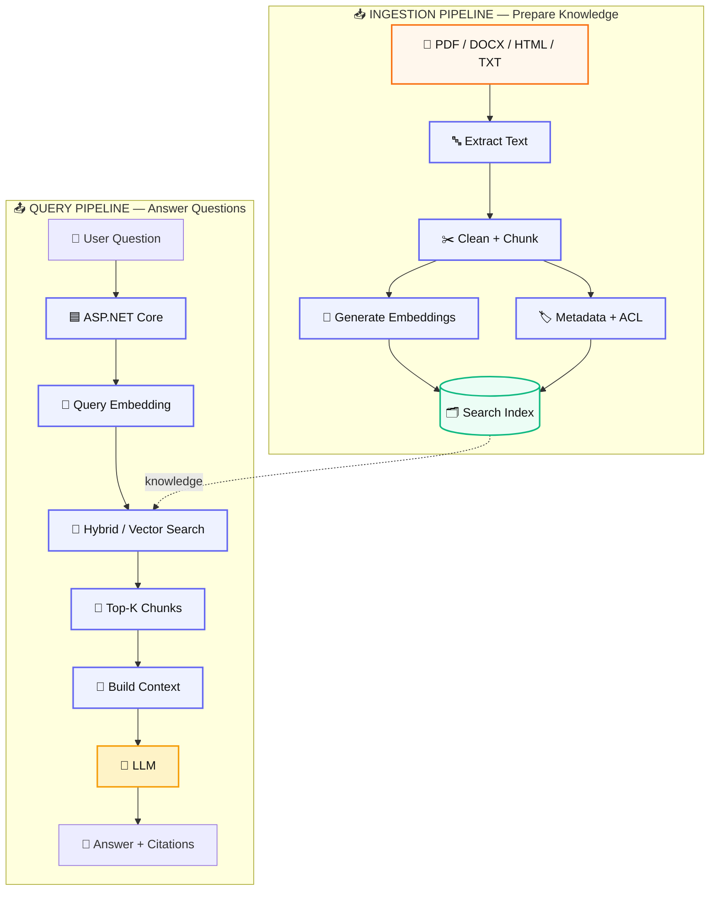
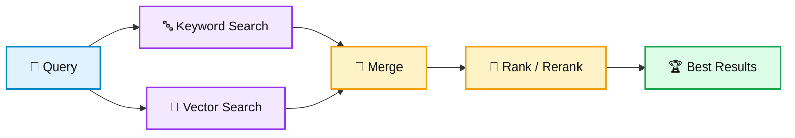
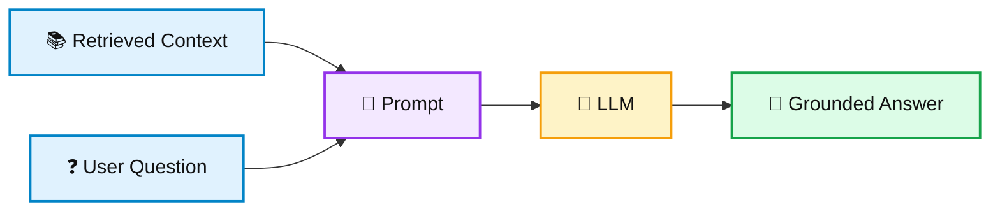
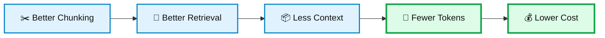

# 🔎 RAG Using C# & .NET — From Zero to Production

> **A practical, visual, step-by-step guide for .NET developers building Retrieval-Augmented Generation (RAG) applications with C#, ASP.NET Core and Azure AI.**

[](https://learn.microsoft.com/dotnet/csharp/)
[](https://dotnet.microsoft.com/)
[](https://learn.microsoft.com/aspnet/core/)
[](https://azure.microsoft.com/products/ai-services/)
[](https://en.wikipedia.org/wiki/Retrieval-augmented_generation)
[](https://github.com/)

**Keywords:** `C#` `DotNet` `.NET` `ASP.NET Core` `RAG` `Retrieval-Augmented Generation` `Generative AI` `GenAI` `LLM` `Embeddings` `Vector Search` `Hybrid Search` `Azure AI Search` `Azure OpenAI` `Semantic Search` `AI Engineering` `Enterprise AI` `Document Intelligence`

---

## ⭐ What You Will Learn

By the end of this guide, you will understand how to build this:

```mermaid
flowchart LR
    U([👤 User]) --> API[🟦 ASP.NET Core API]
    API --> Q[🧠 Query Processing]
    Q --> E[🔢 Query Embedding]
    E --> S[(🔎 Azure AI Search)]
    S --> R[📚 Relevant Chunks]
    R --> P[📝 Prompt + Context]
    P --> L[🤖 LLM]
    L --> A([💬 Grounded Answer])

    classDef user fill:#E8F4FF,stroke:#0078D4,stroke-width:3px,color:#111
    classDef app fill:#EDE9FE,stroke:#7C3AED,stroke-width:2px,color:#111
    classDef search fill:#DCFCE7,stroke:#16A34A,stroke-width:2px,color:#111
    classDef llm fill:#FFF4CC,stroke:#F59E0B,stroke-width:2px,color:#111
    class U,A user
    class API,Q,E,P app
    class S,R search
    class L llm
```



### In simple words

**RAG = Search first → Give useful information to the LLM → Generate an answer grounded in that information.**

Think of an LLM as a very capable engineer. RAG gives that engineer a **searchable company library** before asking the question.

---

# 🧭 RAG in 60 Seconds

Without RAG:

```text
User → LLM → Answer
```

With RAG:

```text
User
 ↓
Search your knowledge
 ↓
Find relevant information
 ↓
Give that information to the LLM
 ↓
Generate grounded answer
```

### The key idea

> **The LLM should not be your database. Your application retrieves authoritative information and gives the relevant context to the model.**

---

# 🏗️ The Complete RAG Architecture

A production RAG system normally has **two pipelines**.



> 🎨 **Visual note:** GitHub renders Mermaid diagrams natively. The diagrams are intentionally styled with colors and directional flow. GitHub Markdown does not provide CSS-based animation inside a `.md` file, so these are **animated-style flow diagrams** rather than true motion graphics.

---

# 🧩 Step 1 — Understand the Core Building Blocks

## 1. Documents 📄

Your knowledge can come from:

- PDF
- Word / DOCX
- HTML
- Markdown
- TXT
- Product documentation
- Policies
- FAQs
- Support tickets
- Database records
- Internal knowledge bases

---

## 2. Chunking ✂️

LLMs and search systems work better when large documents are divided into useful pieces.

```text
📄 100-page document
       │
       ▼
┌──────────────┐
│   Chunk 001  │
├──────────────┤
│   Chunk 002  │
├──────────────┤
│   Chunk 003  │
├──────────────┤
│      ...     │
├──────────────┤
│   Chunk N    │
└──────────────┘
```

### Common chunking strategies

| Strategy | Simple idea | Good for |
|---|---|---|
| Fixed-size | Split every N characters/tokens | Simple prototypes |
| Sentence | Keep sentences together | Natural language |
| Paragraph | Split by paragraphs | Documentation |
| Recursive | Split using a hierarchy | General-purpose RAG |
| Structure-aware | Respect headings/tables/sections | Enterprise documents |

### Simple C# model

```csharp
public sealed class DocumentChunk
{
    public string Id { get; init; } = default!;
    public string DocumentId { get; init; } = default!;
    public string Content { get; init; } = default!;
    public int ChunkIndex { get; init; }

    public Dictionary<string, string> Metadata { get; init; } = new();
}
```

---

# 🔢 Step 2 — Understand Embeddings

An embedding converts text into a numerical representation.

```text
"How do I reset my password?"
              │
              ▼
       🧠 Embedding Model
              │
              ▼
 [0.021, -0.184, 0.732, ...]
```

The important idea is **semantic similarity**.

For example:

```text
"How can I change my password?"
             ↕
"Where do I reset my password?"
```

These sentences use different words but have a similar meaning.

---

# 🔎 Step 3 — Understand Retrieval

RAG can retrieve information using:

### 🔤 Keyword Search

Matches words.

```text
"Azure Service Bus"
       ↓
Find documents containing those words
```

### 🧠 Vector Search

Matches semantic meaning.

```text
"How do messages move between services?"
       ↓
Find content about messaging/event communication
```

### 🔥 Hybrid Search

Combines both.



**Rule of thumb:** start simple, measure retrieval quality, then improve chunking, filters, hybrid search and reranking.

---

# 🎯 Step 4 — Reranking

Imagine retrieval returns 100 possible chunks.

```text
100 Candidates
      ↓
Initial Search
      ↓
20 Candidates
      ↓
Reranking
      ↓
5 Best Chunks
      ↓
LLM
```

The goal is to give the LLM **less but better context**.

---

# 🤖 Step 5 — Grounded Generation

A basic RAG prompt can look like this:

```csharp
var prompt = $"""
Answer the user's question using only the supplied context.

Context:
{context}

Question:
{question}

Rules:
1. Do not invent facts.
2. If the answer is not in the context, say that it is not available.
3. Keep the answer concise.
""";
```

The important flow is:



---

# ☁️ Step 6 — Recommended Azure + .NET Stack

| Layer | Technology |
|---|---|
| API | ASP.NET Core |
| Language | C# |
| LLM | Azure OpenAI / compatible LLM |
| Search | Azure AI Search |
| Documents | Azure Blob Storage |
| Embeddings | Embedding model |
| Background jobs | Azure Functions |
| Messaging | Azure Service Bus |
| Secrets | Azure Key Vault |
| Identity | Microsoft Entra ID |
| Monitoring | Azure Monitor / Application Insights |
| Containers | Docker / Azure Container Apps / AKS |
| CI/CD | GitHub Actions / Azure DevOps |

---

# 🛠️ Step 7 — Create the .NET Solution

```bash
dotnet new sln -n RagApplication

dotnet new webapi -n RagApplication.Api
dotnet new classlib -n RagApplication.Application
dotnet new classlib -n RagApplication.Domain
dotnet new classlib -n RagApplication.Infrastructure

dotnet new xunit -n RagApplication.Tests

dotnet sln add RagApplication.Api
dotnet sln add RagApplication.Application
dotnet sln add RagApplication.Domain
dotnet sln add RagApplication.Infrastructure
dotnet sln add RagApplication.Tests
```

Recommended structure:

```text
RagApplication/
│
├── RagApplication.Api/
│   ├── Controllers/
│   ├── Program.cs
│   └── appsettings.json
│
├── RagApplication.Application/
│   ├── Interfaces/
│   ├── Services/
│   └── DTOs/
│
├── RagApplication.Domain/
│   ├── Entities/
│   └── ValueObjects/
│
├── RagApplication.Infrastructure/
│   ├── AzureOpenAI/
│   ├── AzureSearch/
│   ├── BlobStorage/
│   └── Persistence/
│
└── RagApplication.Tests/
    ├── Unit/
    └── Integration/
```

---

# 🔌 Step 8 — Keep Azure-Specific Code Behind Interfaces

This keeps your application modular.

```csharp
public interface IEmbeddingService
{
    Task<float[]> GenerateAsync(
        string text,
        CancellationToken cancellationToken = default);
}

public interface IRetrievalService
{
    Task<IReadOnlyList<DocumentChunk>> SearchAsync(
        string query,
        int topK,
        CancellationToken cancellationToken = default);
}

public interface IChatService
{
    Task<string> GenerateAsync(
        string prompt,
        CancellationToken cancellationToken = default);
}
```

### Why?

Your application should depend on **abstractions**, not directly on one vendor.

```text
Application
    │
    ├── IEmbeddingService
    ├── IRetrievalService
    └── IChatService
             │
             ▼
       Infrastructure
       ├── Azure implementation
       ├── Other provider
       └── Test implementation
```

---

# 🚀 Step 9 — Build RAG Incrementally

## 🟢 Level 1 — Learn

Understand:

- LLMs
- Tokens
- Context windows
- Embeddings
- Vector search
- Prompt engineering
- Retrieval

## 🟡 Level 2 — Build

Implement:

- Document ingestion
- Text extraction
- Chunking
- Embedding generation
- Search index
- Search API
- Chat API

## 🟠 Level 3 — Improve

Add:

- Hybrid search
- Metadata filters
- Reranking
- Citations
- Conversation history
- Query rewriting
- Evaluation

## 🔴 Level 4 — Productionize

Add:

- Authentication
- Authorization
- Document-level ACL
- Tenant isolation
- Secrets management
- Logging
- Metrics
- Distributed tracing
- Rate limiting
- Resilience
- Cost controls
- Security

---

# 🧪 Step 10 — Evaluate Your RAG

Do not ask only:

> "Does the demo look good?"

Measure it.

| Metric | Question |
|---|---|
| Retrieval relevance | Did we find useful chunks? |
| Context relevance | Is the supplied context useful? |
| Groundedness | Is the answer supported by context? |
| Answer correctness | Is the answer actually correct? |
| Citation accuracy | Do citations point to the right source? |
| Latency | How quickly did we respond? |
| Cost | How many tokens/API calls did we use? |
| Failure rate | How often does the workflow fail? |

Create a dataset:

```text
Question
Expected Answer
Expected Source
Retrieved Sources
Generated Answer
Score
```

---

# 🔐 Step 11 — Secure Your RAG

Enterprise RAG is not just an AI problem.

Protect:

- 🔐 Authentication
- 👮 Authorization
- 📄 Document-level permissions
- 🏢 Tenant isolation
- 🔑 Secrets
- 🧑‍💼 PII
- 🛡️ Prompt injection
- 🚫 Data leakage
- 📝 Audit logs
- ✅ Input/output validation

> ⚠️ **Treat retrieved documents and model output as untrusted input.**

A malicious document can contain instructions designed to influence an agent or model.

---

# 💰 Step 12 — Optimize Cost

The basic optimization chain:



Useful techniques:

- Retrieve only necessary chunks.
- Limit context size.
- Cache repeated requests.
- Use smaller models for simple tasks.
- Avoid unnecessary LLM calls.
- Batch ingestion.
- Monitor token usage.
- Set budgets and rate limits.

---

# 📊 Production RAG Observability

Track:

```text
Request
 ├── API latency
 ├── Query processing
 ├── Embedding latency
 ├── Search latency
 ├── Retrieved chunks
 ├── LLM latency
 ├── Input tokens
 ├── Output tokens
 ├── Tool calls
 ├── Errors
 └── Total cost
```

---

# 🏆 Projects to Build

### 🟢 Beginner

**PDF Q&A Assistant**

```text
PDF → Chunk → Embed → Search → LLM → Answer
```

### 🟡 Intermediate

**Enterprise Knowledge Assistant**

Add:

- Authentication
- Citations
- Metadata filtering
- Multiple document types

### 🟠 Advanced

**Secure Multi-Tenant RAG**

Add:

- Tenant isolation
- Document ACL
- RBAC
- Audit logging
- Evaluation

### 🔴 Architect

**RAG + Agentic AI Platform**

```text
RAG
 +
Tools
 +
Agents
 +
MCP
 +
Security
 +
Evaluation
 +
Observability
 +
Cost Management
```

---

# ✅ Production Checklist

- [ ] Authentication
- [ ] Authorization
- [ ] Document ACL
- [ ] Tenant isolation
- [ ] Secure secrets
- [ ] Good chunking strategy
- [ ] Hybrid/vector retrieval
- [ ] Metadata filtering
- [ ] Reranking where useful
- [ ] Citation support
- [ ] Evaluation dataset
- [ ] Grounding evaluation
- [ ] Prompt-injection defenses
- [ ] Logging
- [ ] Metrics
- [ ] Tracing
- [ ] Rate limiting
- [ ] Retry/resilience
- [ ] Token monitoring
- [ ] Cost monitoring
- [ ] CI/CD
- [ ] Infrastructure automation

---

# 🗺️ Recommended Learning Path

```text
C# / .NET
   ↓
ASP.NET Core
   ↓
Azure Fundamentals
   ↓
LLM Fundamentals
   ↓
Prompt Engineering
   ↓
Embeddings
   ↓
Vector / Hybrid Search
   ↓
RAG
   ↓
Azure AI Search
   ↓
Azure OpenAI
   ↓
AI Agents
   ↓
Agentic AI
   ↓
Production AI Architecture
```

---

# 🎯 Final Goal

The goal is **not** to build another chatbot.

The goal is to become capable of designing:

> **Secure + Scalable + Observable + Evaluated + Cost-Aware + Production-Ready AI applications using C# and .NET.**

### 🔥 Next Step

After this guide, continue with:

**[GenAI & Agentic AI with .NET and Azure AI](./Guide-for-DotNet-Developer-GenAI-Agentic-AI.md)**

---

## 🔎 SEO / GitHub Keywords

`dotnet-ai` `csharp-ai` `csharp-genai` `dotnet-genai` `rag-csharp` `rag-dotnet` `azure-ai` `azure-openai` `azure-ai-search` `retrieval-augmented-generation` `vector-search` `hybrid-search` `semantic-search` `llm` `generative-ai` `enterprise-ai` `ai-engineering` `ai-architecture` `aspnet-core` `document-intelligence`
